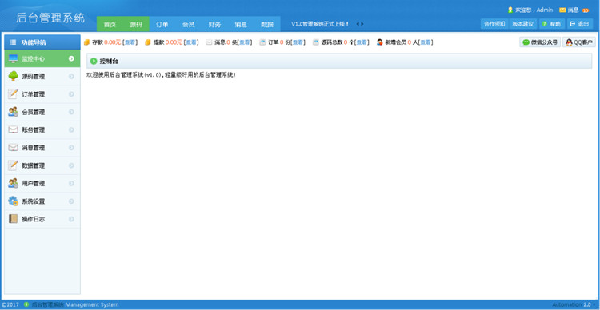

# Java - 神码服云
### 开发语言：Java
### 开发工具：Eclipse
## 网站简述：
一个专注于资源共享的web网站，是我在北大青鸟培训期间学习JavaEE的实战项目。JDBC原生态编码，没有用任何框架，使用到了很多技术栈，例如ajax异步刷新、手机动态验证码、百度富文本编辑器、JSTL表达式+分页等，很适合刚入门的Java后端小白参考学习。
## 使用说明：
1. 使用Eclipse导入项目时，请自行更改相应的jdk和Tomcat版本。
2. 导入数据库文件zy_db.sql
3. 修改src目录下com.smfy.dao.BaseDao.java文件里的数据库信息。
## 网站截图：
首页

后台

